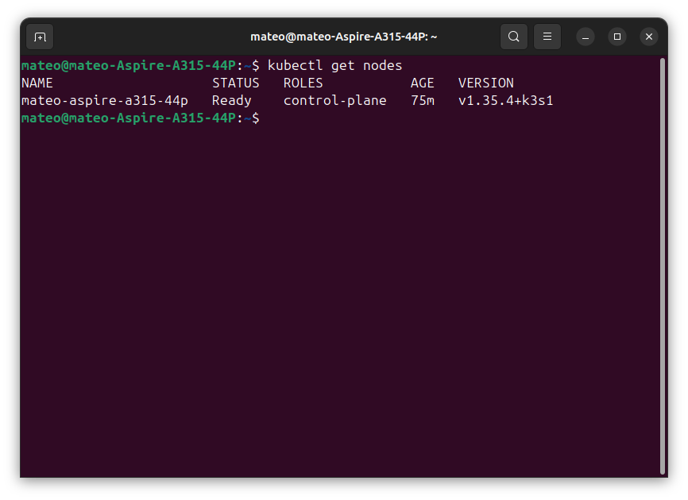
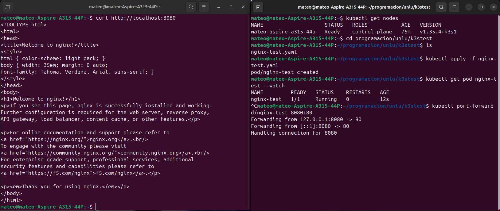

# TP1-Selenium

Scraper de MercadoLibre Argentina con Selenium, Docker y Kubernetes.

## Prerrequisitos cumplidos (TP 0)

`kubectl get nodes` devuelve el nodo en estado `Ready`:



Nginx de prueba corriendo y accesible via `curl localhost:8080`:



---

## Estructura

```
TP1-Selenium/
├── hit1/        # Scraper básico (un producto)
├── hit2/        # Multi-browser (Chrome + Firefox)
├── hit3/        # Screenshots + filtros
├── hit4/        # Multi-producto + extracción de campos
├── hit5/        # Robustez: retry, backoff, selectores centralizados
├── hit6/        # Tests automatizados (pytest, 95% cobertura)
├── hit7/        # Docker + Kubernetes (Job + CronJob)
├── hit8/        # Paginación + estadísticas + PostgreSQL
└── docker-compose.yml
```

---

## Parte 1 — Hits 1 a 6 (local)

```bash
cd hitX
python3 -m venv .venv && source .venv/bin/activate
pip install -r requirements.txt
BROWSER=chrome HEADLESS=true python scraper.py
```

Tests (hit6 en adelante):

```bash
pip install pytest pytest-cov
python -m pytest --cov=. --cov-fail-under=70 -v
```

---

## Parte 2 — Docker

```bash
# Build
docker build -t ml-scraper:latest hit8/

# Correr con docker compose
docker compose up scraper
BROWSER=firefox docker compose up scraper
docker compose run --rm lint
```

---

## Hit #7 — Kubernetes

### Importar la imagen al cluster

**k3s nativo:**
```bash
docker build -t ml-scraper:latest hit7/
docker save ml-scraper:latest -o /tmp/ml-scraper.tar
sudo k3s ctr images import /tmp/ml-scraper.tar
rm /tmp/ml-scraper.tar
```

**k3d:**
```bash
k3d image import ml-scraper:latest -c <nombre-del-cluster>
```

### Aplicar manifests y verificar

```bash
kubectl apply -f hit7/k8s/

# Seguir el Job one-off
kubectl get pods -l job-type=one-off
kubectl logs -l job-type=one-off -f

# Verificar el CronJob
kubectl get cronjobs
kubectl get jobs --watch

# Limpiar
kubectl delete -f hit7/k8s/
```

---

## Hit #8 — Kubernetes con PostgreSQL

### Nuevas capacidades

| Capacidad | Descripción |
|---|---|
| Paginación | Hasta 30 resultados navegando 3 páginas por producto |
| Estadísticas | Tabla min/max/mediana/promedio/desvío en stdout + `output/stats.json` |
| Histórico | Resultados persistidos en PostgreSQL para acumular corridas del CronJob |

### Despliegue

# 1. Crear el Secret (NUNCA commitear este archivo)
```bash
# El archivo k8s/postgres-secret.yaml está en .gitignore.
# Crearlo manualmente o inyectarlo desde CI como GitHub Secret.
cat > hit8/k8s/postgres-secret.yaml <<'EOF'
apiVersion: v1
kind: Secret
metadata:
  name: postgres-credentials
  labels:
    app: postgres
type: Opaque
stringData:
  POSTGRES_DB: scraper_db
  POSTGRES_USER: scraper
  POSTGRES_PASSWORD: <tu-password-segura>
EOF

# 2. Importar imagen y aplicar manifests
docker build -t ml-scraper:latest hit8/
docker save ml-scraper:latest -o /tmp/ml-scraper.tar
sudo k3s ctr images import /tmp/ml-scraper.tar && rm /tmp/ml-scraper.tar
kubectl apply -f hit8/k8s/

# 3. Esperar Postgres y seguir logs
kubectl wait --for=condition=ready pod -l app=postgres --timeout=120s
kubectl logs -l job-type=one-off -f

# 4. Consultar histórico
kubectl exec -it $(kubectl get pod -l app=postgres -o jsonpath='{.items[0].metadata.name}') \
  -- psql -U scraper -d scraper_db -c \
  "SELECT producto, MIN(precio), MAX(precio), COUNT(*) FROM scrape_results GROUP BY producto;"

# 5. Limpiar
kubectl delete -f hit8/k8s/
kubectl delete secret postgres-credentials
```

### Variables de entorno

| Variable | Descripción | Default |
|---|---|---|
| `BROWSER` | `chrome` \| `firefox` | `chrome` |
| `HEADLESS` | `true` \| `false` | `true` |
| `MAX_PAGES` | Páginas por producto | `3` |
| `PRODUCTS` | Lista separada por newline | 3 productos por defecto |
| `POSTGRES_HOST` | Si no está definido, se omite la escritura a la DB | — |

---

## Pre-commit hooks

```bash
pip install pre-commit
pre-commit install          # activa los hooks localmente
pre-commit run --all-files  # corre manualmente
```

Hooks: `gitleaks` (secrets), `ruff` (linter + formatter), `check-yaml`.
