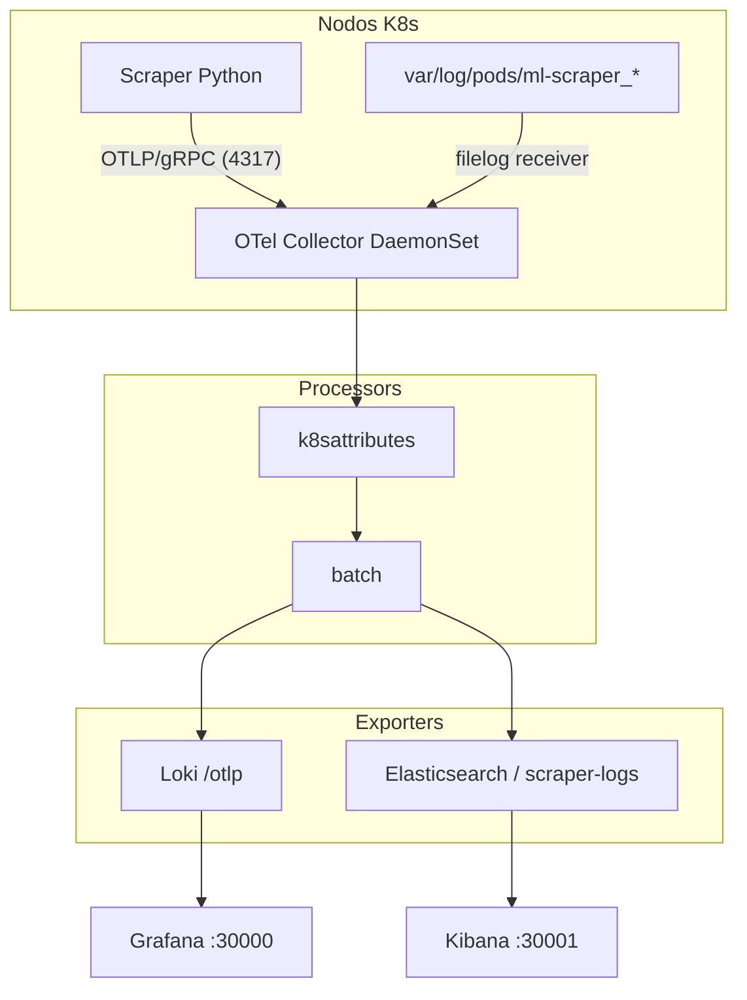

# OpenTelemetry Collector & Observabilidad

Este subproyecto contiene la configuración completa e instrumentación para desplegar OpenTelemetry (OTel) Collector en nuestro cluster Kubernetes local (k3s), logrando un pipeline de observabilidad unificado y libre de lock-in.

## Estructura del Proyecto

```text
otel/
├── README.md                          # Este archivo
├── install.sh                         # Script de instalación idempotente y automatizado
├── helm/
│   └── otel-operator-values.yaml      # Configuración para el OpenTelemetry Operator Helm Chart
├── manifests/
│   ├── namespace.yaml                 # Namespace otel
│   ├── collector-agent.yaml           # Recurso OpenTelemetryCollector (DaemonSet + Pipeline)
│   ├── rbac.yaml                      # ServiceAccount y ClusterRole para el k8sattributes processor
│   └── scraper-otlp-config.yaml       # ConfigMap para inyectar endpoints OTel al scraper
├── scraper-instrumentation/
│   ├── otel_setup.py                  # Módulo Python para configurar providers de logs y trazas
│   └── requirements-otel.txt          # Dependencias de Python necesarias
└── screenshots/                       # Capturas de pantalla de la verificación (fan-out)
```

## Arquitectura de Observabilidad

La solución reemplaza los agentes legacy (Promtail y Fluent Bit) por un único agente recolector neutral:



## Requisitos Previos

- Tener Loki y Grafana instalados y corriendo en el namespace `observability`.
- Tener Elasticsearch y Kibana instalados y corriendo en el namespace `elastic`.

## Despliegue de la Infraestructura

Para desplegar de forma automatizada todo el stack de OpenTelemetry (incluyendo `cert-manager` si no existe, el `opentelemetry-operator` y el propio Collector con su RBAC y secretos):

```bash
./install.sh
```

El script de instalación se encarga de:
1. Validar que Loki y Elasticsearch estén disponibles en el cluster.
2. Levantar `cert-manager` para la gestión de certificados de admisión Webhooks requeridos por el Operator.
3. Instalar el OpenTelemetry Operator en el namespace `otel-operator-system`.
4. Copiar de forma dinámica el secret de credenciales de Elasticsearch al namespace `otel`.
5. Desplegar el DaemonSet del Colector y su RBAC asociado.
6. Apagar/escalar a 0 los agentes heredados (Promtail y Fluent Bit) mediante parches de `nodeSelector`.
7. Imprimir las URLs del cluster para comprobar el correcto funcionamiento de la recolección distribuida.

## Instrumentación en Python

Para utilizar la instrumentación OTel en el scraper:
1. Instalar las dependencias de `scraper-instrumentation/requirements-otel.txt`.
2. Importar y llamar a `setup_otel()` al inicio del script de la aplicación:

```python
from otel_setup import setup_otel

# Inicializar configuración de OpenTelemetry
setup_otel(service_name="scraper")
```

De esta manera, el SDK de OpenTelemetry se encargará de interceptar y enviar automáticamente todos los logs y trazas de la aplicación vía OTLP gRPC hacia el Collector OTel en el puerto `4317`.

# Hit #2 - Validación del Pipeline

```bash
# Aplicar el collector CRD
kubectl apply -f manifests/collector-agent.yaml

# Verificar deployment
kubectl -n otel get otelcol
kubectl -n otel get ds/agent-collector
kubectl -n otel rollout status ds/agent-collector --timeout=120s

# Disparar tráfico de prueba
kubectl -n ml-scraper create job --from=cronjob/scraper-hourly scraper-otel-test-1
kubectl -n ml-scraper wait --for=condition=complete job/scraper-otel-test-1 --timeout=600s

# Ver logs procesados
kubectl -n otel logs ds/agent-collector | grep -A 10 "ResourceLog"

# Validar que aparezcan atributos k8s:
# - k8s.namespace.name: ml-scraper
# - k8s.pod.name: scraper-*
# - k8s.cronjob.name: scraper-hourly
# - service: scraper
```

## Hit #3 - Fan-out Multi-Backend

### Aplicar cambios
```bash
# El install.sh ya incluye estos pasos
./install.sh

# O manualmente:
kubectl apply -f manifests/collector-agent.yaml
kubectl -n otel rollout status ds/agent-collector --timeout=120s
```

### Verificar fan-out
```bash
# 1. Disparar tráfico
kubectl -n ml-scraper create job --from=cronjob/scraper-hourly scraper-fanout-1
kubectl -n ml-scraper wait --for=condition=complete job/scraper-fanout-1 --timeout=600s

# 2. Verificar en ambos backends
# Ver docs/hit3-fanout-verification.md para queries específicas
```

### Screenshots requeridos
- `screenshots/hit3-fanout-loki.png` - Grafana mostrando log con log_id
- `screenshots/hit3-fanout-elastic.png` - Kibana mostrando el MISMO log_id

**CRÍTICO**: Sin estos 2 screenshots mostrando el mismo log_id, el Hit #3 vale 0 puntos.

## Hit #4 - Reemplazo de Agentes Legacy

### Concepto
Demostrar que OTel Collector reemplaza completamente a Promtail/Alloy + Fluent Bit.

**Por qué `scale --replicas=0` y no `helm uninstall`:**
- Rollback instantáneo en caso de problemas (escalar a 1 tarda 30 segundos)
- En producción: mantener agentes legacy "fríos" por 1-2 semanas durante período de bake
- `helm uninstall` es destructivo y reinstalar tarda varios minutos

### Despliegue
El script `install.sh` ya escala los agentes legacy a 0 automáticamente.

```bash
./install.sh
```

### Verificación Manual

**1. Estado de DaemonSets (legacy deben estar en 0):**
```bash
kubectl get ds -A | grep -E 'promtail|alloy|fluent-bit|agent-collector'
```

Esperado:
```
observability   promtail/alloy     0    0    0    0    0
elastic         fluent-bit         0    0    0    0    0
otel            agent-collector    1    1    1    1    1
```

**2. Disparar job de prueba:**
```bash
kubectl -n ml-scraper create job --from=cronjob/scraper-hourly scraper-otel-only-1
kubectl -n ml-scraper wait --for=condition=complete job/scraper-otel-only-1 --timeout=600s
```

**3. Verificar en Grafana (Loki):**
- URL: http://<node-ip>:30000
- Explore → Loki
- Query: `{service="scraper", k8s_namespace_name="ml-scraper", k8s_job_name="scraper-otel-only-1"}`
- Deben aparecer logs del job

**4. Verificar en Kibana (Elasticsearch):**
- URL: http://<node-ip>:30001
- Discover → index `scraper-logs-*`
- Search: `k8s.job.name : "scraper-otel-only-1"`
- Deben aparecer los mismos logs

### Troubleshooting

Si los logs no aparecen en ningún backend:
```bash
# Verificar que OTel Collector está procesando
kubectl -n otel logs ds/agent-collector --tail=100 | grep -i "exported\|error"

# Verificar que el job del scraper generó logs
kubectl -n ml-scraper logs job/scraper-otel-only-1
```

Si solo aparecen en uno de los backends:
```bash
# Ver errores del collector
kubectl -n otel logs ds/agent-collector | grep -i "error\|failed"

# Verificar conectividad a Loki
kubectl -n otel exec ds/agent-collector -- curl http://loki.observability:3100/ready

# Verificar conectividad a Elasticsearch
kubectl -n otel exec ds/agent-collector -- curl -k https://elasticsearch-master.elastic:9200/_cluster/health
```

### Rollback
```bash
# Reactivar Promtail (o Alloy)
kubectl -n observability scale ds/promtail --replicas=1

# Reactivar Fluent Bit
kubectl -n elastic scale ds/fluent-bit --replicas=1

# Esperar que levanten
kubectl -n observability rollout status ds/promtail --timeout=120s
kubectl -n elastic rollout status ds/fluent-bit --timeout=120s
```

### Métricas de Reducción
- **Pods eliminados**: 2 DaemonSets (uno por nodo = ~2-6 pods según cluster)
- **Reducción de recursos**: ~50% menos pods de logging activos
- **Configuraciones a mantener**: 2 agentes → 1 agente
- **Funcionalidad perdida**: 0 (ambos backends siguen recibiendo logs)

### Screenshot Requerido
- `screenshots/hit4-old-agents-down.png` debe mostrar:
  - Output de `kubectl get ds -A` con legacy en 0 y OTel activo
  - Logs en Grafana del job `scraper-otel-only-1`
  - Logs en Kibana del mismo job

Puede ser un screenshot compuesto/collage de los 3 elementos.

# Verificar deployment
kubectl get pods -n otel-operator-system
kubectl get otelcol -n otel
kubectl get ds -n otel
kubectl logs -n otel -l app.kubernetes.io/component=opentelemetry-collector


